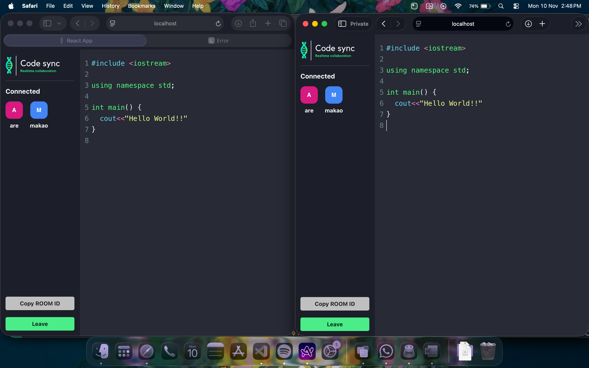

# 🚀 CodeField - Real-time Collaborative Code Editor

<div align="center">
  
  
  
  
</div>

<br/>

## 📝 About

**CodeField** is a real-time collaborative code editor that allows multiple developers to code together in the same virtual room. Built with React, Socket.IO, and CodeMirror, it provides a seamless coding experience with live synchronization across all connected users.

## ✨ Features

- 🔄 **Real-time Collaboration** - Multiple users can edit code simultaneously
- 🎨 **Syntax Highlighting** - Support for multiple programming languages (JavaScript, Python, C++, Java, PHP, SQL, HTML, CSS, and more)
- 🌙 **Dracula Theme** - Beautiful dark theme for comfortable coding
- 👥 **User Presence** - See who's connected in real-time
- 🔗 **Room-based Sessions** - Create or join coding rooms with unique IDs
- 📋 **Copy Room ID** - Easy sharing with one-click copy
- 🔌 **WebSocket Connection** - Fast and reliable real-time updates
- 💡 **Auto-complete Features** - Automatic bracket and tag closing

## 🖼️ Screenshot



*Real-time collaborative coding with syntax highlighting*

## 🛠️ Tech Stack

- **Frontend**: React.js, React Router, CodeMirror
- **Backend**: Node.js, Express.js, Socket.IO
- **Styling**: CSS3
- **Other**: React Hot Toast for notifications, React Avatar for user avatars

## 🚀 Getting Started

### Prerequisites

- Node.js (v14 or higher)
- npm or yarn

### Installation

1. **Clone the repository**
   ```bash
   git clone https://github.com/AdityaRanjanJha/CodeField.git
   cd CodeField
   ```

2. **Install dependencies**
   ```bash
   npm install
   ```

3. **Create environment file**
   
   Create a `.env` file in the root directory:
   ```env
   REACT_APP_BACKEND_URL=http://localhost:5001
   ```

### Running the Application

#### Development Mode

1. **Start the backend server** (in one terminal)
   ```bash
   PORT=5001 npm run server:dev
   ```

2. **Start the React frontend** (in another terminal)
   ```bash
   npm run start:front
   ```

3. **Open your browser**
   
   Navigate to `http://localhost:3000`

#### Production Mode

1. **Build the React app**
   ```bash
   npm run build
   ```

2. **Start the production server**
   ```bash
   npm start
   ```

## 📖 Usage

1. **Enter your username** on the home page
2. **Create a new room** by generating a room ID or **join an existing room** by entering a room ID
3. **Click "Join"** to enter the collaborative coding session
4. **Start coding!** Your changes will be synchronized in real-time with all connected users
5. **Share the Room ID** with others using the "Copy ROOM ID" button
6. **Leave** the room anytime by clicking the "Leave" button

## 🎯 Supported Languages

The editor provides syntax highlighting for:
- JavaScript / TypeScript
- Python
- C / C++ / Java
- PHP
- SQL
- HTML / XML
- CSS
- And many more!

## 📁 Project Structure

```
CodeField/
├── public/              # Public assets
├── src/
│   ├── components/      # React components
│   │   ├── Client.js    # Connected user component
│   │   └── Editor.js    # CodeMirror editor component
│   ├── pages/          # Page components
│   │   ├── home.js     # Landing page
│   │   └── editorpage.js # Editor room page
│   ├── Actions.js      # Socket event constants
│   ├── socket.js       # Socket.IO client setup
│   └── App.js          # Main app component
├── server.js           # Express + Socket.IO server
└── package.json        # Dependencies
```

## 🔧 Available Scripts

- `npm run start:front` - Start React development server
- `npm run server:dev` - Start backend server with nodemon
- `npm start` - Build and start production server
- `npm run build` - Build React app for production
- `npm test` - Run tests

## 🤝 Contributing

Contributions are welcome! Feel free to open issues or submit pull requests.

## 📄 License

This project is open source and available under the MIT License.

## 👨‍💻 Author

**Aditya Ranjan Jha**

---

<div align="center">
  Made with ❤️ by Aditya Ranjan Jha
</div>
